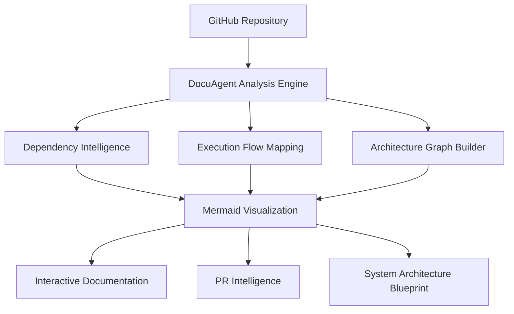
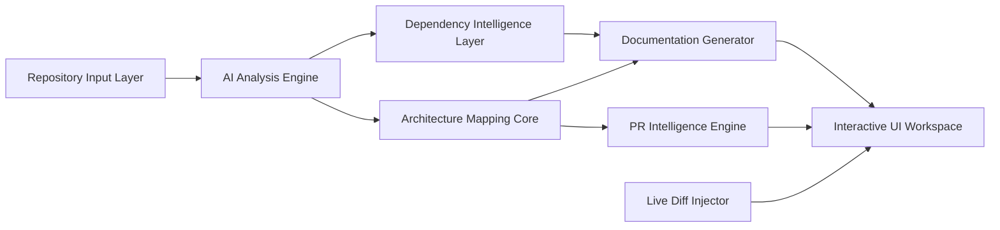

#  DocuAgent - The Architectural Intelligence Layer for Modern Codebases

<div align="center">


<br/>
<br/>

### Transform Raw Repositories into Living Technical Intelligence

DocuAgent is an AI-powered architecture orchestration platform that converts complex codebases into interactive architecture diagrams, structured technical documentation, dependency intelligence, and production-ready PR summaries automatically.

<br/>

<p align="center">
  
  
  
  
  
</p>

<br/>

<p align="center">
  <a href="#-overview">Overview</a> •
  <a href="#-features">Features</a> •
  <a href="#-architecture">Architecture</a> •
  <a href="#-tech-stack">Tech Stack</a> •
  <a href="#-installation">Installation</a> •
  <a href="#-workflow">Workflow</a> •
  <a href="#-roadmap">Roadmap</a>
</p>

</div>

# Live Demo

Frontend:
https://docuagent-wine.vercel.app/

Backend API:

---


# 🚀 Overview

Modern codebases evolve faster than documentation.

Engineering teams waste countless hours:
- Understanding unfamiliar repositories
- Maintaining outdated architecture diagrams
- Writing repetitive pull request descriptions
- Reverse-engineering dependencies
- Mapping execution flows manually

## DocuAgent eliminates that friction.

It acts as an intelligent orchestration layer that:
- Reads repositories deeply
- Understands structural relationships
- Maps dependency intelligence
- Generates architecture diagrams
- Creates technical documentation
- Produces intelligent PR summaries automatically

---

# ✨ Features

##  Repository Analysis

DocuAgent doesn't just parse files.

It understands:
- Dependency trees
- Execution paths
- Module relationships
- Architectural boundaries
- Runtime structures
- Service interactions


---

## 🏛️ Interactive Architecture Mapping

Generate live Mermaid.js architecture graphs instantly.

### Includes:
- Zoomable architecture canvas
- Dynamic node rendering
- Relationship tracing
- Dependency visualization
- Layer-aware architecture mapping
- Interactive graph exploration



---

# 💎 Why DocuAgent?

| Capability | Traditional Workflow | DocuAgent Ecosystem |
|---|---|---|
| Logic Mapping | Manual & Error-Prone | AI-Powered Structural Analysis |
| Architecture Diagrams | Static & Outdated | Dynamic Interactive Graphs |
| Documentation | Tedious & Inconsistent | Automated Technical Intelligence |
| Pull Requests | Repetitive Boilerplate | AI-Generated Contextual PRs |
| Dependency Understanding | Fragmented | Unified Repository Cognition |
| Developer Onboarding | Slow | Instant Architecture Clarity |
| Maintenance | High Friction | Zero-Touch Automation |

---

# 🏛️ System Architecture

## High-Level Architecture



---

# ⚡ Core Platform Capabilities

## 📥 Repository Ingestion Engine

Rapidly ingest public GitHub repositories for deep analysis.

### Supports:
- Monorepos
- Full-stack applications
- TypeScript ecosystems
- Node.js infrastructures
- Microservices
- Multi-package workspaces

---

## 🧠 AI Analysis Engine

Powered by Google Gemini 1.5 Pro.

### Performs:
- Semantic code understanding
- Architectural pattern recognition
- Dependency graph generation
- Cross-module intelligence extraction
- Documentation synthesis

---

## 🗺️ Architecture Canvas

An interactive workspace designed for deep technical exploration.

### Features:
- Zoomable graph rendering
- Interactive module inspection
- Dynamic node expansion
- Context-aware navigation
- Architecture tracing

---

## ⚡ Live Diff Injector

A sophisticated patching engine enabling:
- Real-time document refinement
- Architecture updates
- Incremental graph patching
- Live synchronization

---

## 🧱 Bento Grid UX

A modular dashboard optimized for engineering workflows.

### Includes:
- Resizable panels
- Persistent workspaces
- Keyboard-first navigation
- Technical-first layout architecture
- High-density information rendering

---

# 🛠️ Tech Stack

## Intelligence Layer

| Layer | Technology |
|---|---|
| AI Engine | Google Gemini 1.5 Pro |
| AI SDK | Google Generative AI SDK |
| Analysis Core | Custom Semantic Analyzer |
| Diff Engine | Custom State Patching Layer |

---

## Frontend Stack

| Layer | Technology |
|---|---|
| Framework | Next.js  |
| Runtime | React  |
| Bundler | Turbopack |
| Styling | Tailwind CSS |
| UI Architecture | Bento Grid System |
| State Management | Zustand |
| Animation | Framer Motion |

---

## Visualization Layer

| Technology | Purpose |
|---|---|
| Mermaid.js | Architecture Rendering |
| SVG Engine | Dynamic Node Rendering |
| Canvas Layer | Zoom & Pan Interactions |

---


# 📁 Project Structure

```bash
docuagent/
│
├── frontend/                          # Next.js frontend application
│   ├── app/                           # App Router pages & layouts
│   ├── components/                    # Shared UI components
│   ├── public/                        # Static assets
│   ├── services/                      # Frontend service layer
│   ├── styles/                        # Global styles
│   ├── hooks/                         # Custom React hooks
│   ├── lib/                           # Utility libraries
│   ├── package.json                   # Frontend dependencies
│   └── tailwind.config.ts             # Tailwind configuration
│
├── backend/                           # FastAPI backend server
│   ├── agents/                        # AI orchestration agents
│   ├── services/                      # Core backend services
│   ├── routes/                        # API route handlers
│   ├── models/                        # Data models & schemas
│   ├── utils/                         # Backend utilities
│   ├── main.py                        # FastAPI application entry
│   └── requirements.txt               # Python dependencies
│
├── docs/                              # Generated documentation
├── .env.example                       # Environment variables example
├── README.md                          # Project documentation
└── package.json                       # Root package configuration
```

# 🎬 Workflow

## 1️⃣ Repository Ingestion

Provide a GitHub repository URL.

```bash
https://github.com/example/project
```

---

# Sample Repository for Testing
https://github.com/zhanymkanov/fastapi-best-practices.git

https://github.com/Soquixx/Voicebot-grp-C.git

## 2️⃣ AI Structural Analysis

DocuAgent scans:
- Dependency graphs
- Execution paths
- Service boundaries
- Internal architecture

---

## 3️⃣ Architecture Generation

Interactive Mermaid diagrams are generated automatically.

---

## 4️⃣ Documentation Synthesis

The platform produces:
- Technical documentation
- Dependency intelligence
- Architecture summaries
- System overviews

---

## 5️⃣ Intelligent PR Generation

Generate:
- Pull request summaries
- Technical explanations
- Change impact reports
- Architecture-aware documentation

---

# 🖥️ UI Showcase


### 🎥 Live Workflow GIF

https://github.com/user-attachments/assets/1e4a0e1c-5fe9-49a1-94ed-62f5f184fc5a

# ⚙️ Installation

## Clone Repository

```bash
git clone https://github.com/your-username/docuagent

cd docuagent
```

---

## Install Dependencies

```bash
npm install
```

---

## Configure Environment Variables

```bash
cp .env.example .env
```

Add your Gemini API Key:

```env
GEMINI_API_KEY=your_api_key_here
```

# ⚙️ Local Development Setup

## 1️⃣ Frontend Setup

```bash
cd frontend
npm install
npm run dev
```

Runs the frontend at:

```bash
http://localhost:3000
```

---

## 2️⃣ Backend Setup

```bash
cd backend
pip install -r requirements.txt
uvicorn main:app --reload --port 8000
```

Runs the backend API at:

```bash
http://localhost:8000
```
# Example Use Cases

## 🏢 Enterprise Engineering Teams
- Architecture governance
- Repository intelligence
- Cross-team visibility
- Faster onboarding

---

## 🚀 Startups
- Instant documentation
- Faster iteration
- Reduced technical debt
- Better engineering velocity

---

## 👨‍💻 Open Source Maintainers
- Better contributor onboarding
- Cleaner PR workflows
- Auto-generated diagrams
- Transparent architecture

---


# 🔒 Security & Governance

DocuAgent is designed with:
- Secure environment handling
- Stateless repository processing
- Controlled AI execution pipelines
- Minimal external exposure

---

# 📈 Performance Philosophy

Built for:
- Fast architecture rendering
- Incremental graph updates
- Real-time documentation refinement
- Low-latency analysis pipelines

Powered by:
- Turbopack
- Intelligent dependency caching
- Streaming architecture generation

---


# 🛣️ Strategic Roadmap

## ✅ Current Features

- [x] Gemini 1.5 Pro integration
- [x] Mermaid.js architecture rendering
- [x] Repository structural analysis
- [x] Automated documentation generation
- [x] PR template automation

---

## 🔮 Planned

- [ ] Native CI/CD integrations
- [ ] GitHub App deployment
- [ ] Architecture version timelines
- [ ] Multi-agent collaboration engine
- [ ] Live collaborative documentation editing
- [ ] Distributed system topology mode

---


## Development Workflow

```bash
# Fork repository

# Create feature branch
git checkout -b feature/name

# Commit changes
git commit -m "Add filename"

# Push branch
git push origin feature/name

# Open Pull Request
```

---

# 📜 License

Licensed under the MIT License.

```txt
MIT License © 2026 DocuAgent
```

---

# 🌌 Vision

DocuAgent is building toward a future where:

- Documentation updates itself
- Architecture remains alive
- Repositories become intelligent systems
- Engineering knowledge becomes explorable infrastructure

---

<div align="center">

# ⚡ Refine the Future of Documentation

### One Repository at a Time.

<br/>


</div>
